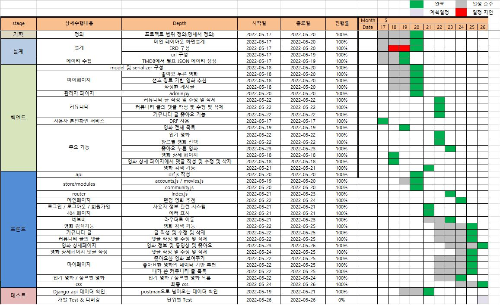
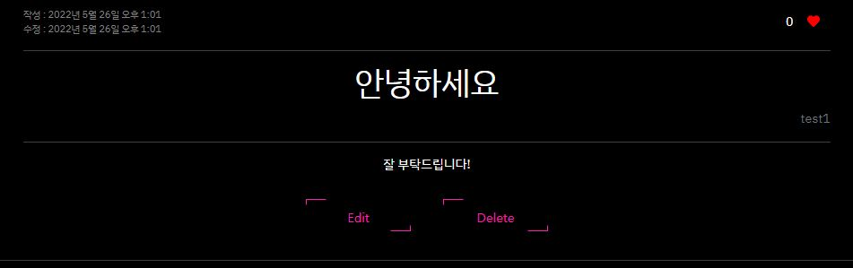
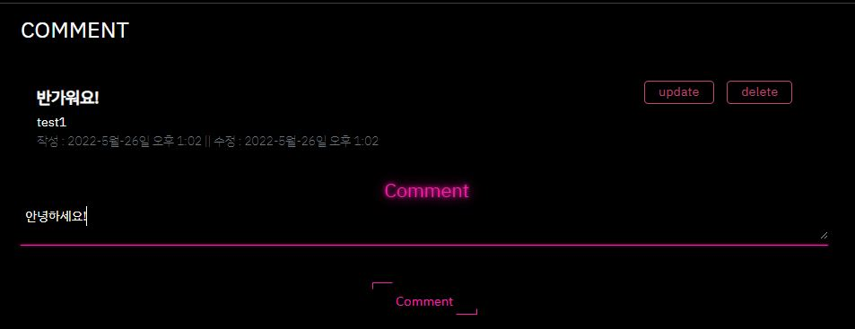

# SE's MOVIE THEATER 

영화 정보를 제공하고 사용자들이 커뮤니티를 통해 소통할 수 있는 사이트입니다.


설명 쓸까요?


--------------------------------

## 1. 팀원 정보 및 업무 분담 내역

- **팀원** : 박세은 , 임상은
- **개발 기간** : 2022년 5월 17일 ~ 5월 26일
- **기술 스택** : 
  - 프론트엔드 : Vue.js , CSS , HTML5, BootStrap
  - 백엔드 : Django, Python
- **업무 분담 내역**
  - backend-임상은 , frontend-박세은

--------------------

## 2. 프로젝트 계획표



-------

## 3. 목표 서비스 구현 및 실제 구현 정도

|           | 구현 정도                                                    |
| --------- | ------------------------------------------------------------ |
| Movie     | 메인 페이지, 전체 영화, 인기영화, 장르별 영화, 영화 상세페이지(영화 정보 및 동영상, 영화에 댓글 생성) |
| Community | 게시글 작성 및 삭제 / 게시글에 댓글 작성 및 삭제 및 좋아요 기능 |
| User      | 회원가입, 로그인 , 로그아웃                                  |
| Search    | 영화 검색 가능                                               |
| Mypage    | 좋아요 누른 영화 , 영화 추천 시스템, 작성한 게시글           |

## 4. 데이터 베이스 모델링 (ERD)


## 5. 기능

- 관리자

  - 관리자 페이지

- 사용자

  - 회원가입

    

  - 로그인

    

  - 로그아웃

  - 마이페이지

    - 좋아요 누른 영화

      

    - 추천 영화

      

    - 내가 쓴 게시글 목록

      

- NavBar

  - NavBar

    

- 영화

  - 영화 상세페이지

    - 영화의 정보 및 동영상 제공

      

    - 사용자의 댓글과 평점 작성 / 수정 / 삭제

      

  - 메인 페이지의 랜덤 추천

    

  - 전체 영화

    - 영화 검색 기능

      

  - 인기 영화

    

  - 장르별 영화

    - 장르 선택 기능

      

- 추천 알고리즘

  - 사용자가 좋아요를 누른 장르들의 데이터를 기반으로 영화를 추천함

- 커뮤니티

  - 게시글 목록 조회

    

  - 게시글 작성 / 수정 / 삭제

    ​	

    - 게시글 상세 페이지

      

    - 댓글 작성 및 수정 및 삭제

      

- 에러페이지

  - 404

    

## 6. 느낀점

- 박세은 

  ```
  
  ```

- 임상은 

  ```
  프로젝트를 진행하면서 backend / frontend 중 한 파트를 공략해서 공부해야하는 것이 아니라 두 분야 모두 잘 이해해야 현업에서 더 나은 개발자가 될 수 있을 것 같다라는 생각을 다시금 하게 되었다.
  
  프로젝트를 진행하는 데 있어서 구현 능력도 중요하지만, 팀원과의 소통 능력도 중요하다고 생각하는데, 10일간 팀원과 소통이 개인적으로 매우 활발했다고 생각해서 여기까지 프로젝트를 도달할 수 있었다고 생각한다.
  작업을 나눠서 할 때도 오류가 생기거나 궁금한게 생기면 거리낌없이 물어볼 수 있어서 좋았고, 내가 찾지 못한 부분은 세은님이 금세 또 찾아주셔서 대부분 원활하게 진행되었다고 생각한다! 
  
  기능 구현을 할 때마다 콘솔창에 찍어보면서 흐름을 파악하는 것이 매우 중요하다는 것을 깨닫게 된 프로젝트였고, 휴식도 중요한 프로젝트의 과정이라는 것을 느끼게 해준 프로젝트였다.
  
  프로젝트를 진행하기엔 짧고, 배운 것을 모두 녹여내는 것 뿐만아니라 추가적으로 구글링도 해야 완성이 가능한 이번 프로젝트를 통해 부족한 것도 많지만, 뭐든 하면 해낼 수 있구나 라는 희망을 계속 품을 수 있게 되었다.
  
  그리고 CSS로 사이트를 취향저격으로 완성해주신 세은님께 감사드립니다! 
  ```

  