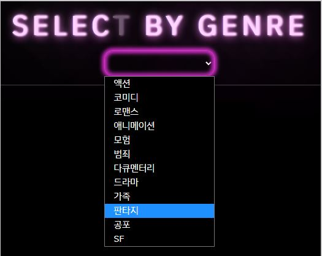

# SE's MOVIE THEATER 

영화 정보를 제공하고 사용자들이 커뮤니티를 통해 소통할 수 있는 사이트입니다.


--------------------------------

## 1. 팀원 정보 및 업무 분담 내역

- **팀원** : 박세은 , 임상은
- **개발 기간** : 2022년 5월 17일 ~ 5월 26일
- **기술 스택** : 
  - 프론트엔드 : Vue.js , CSS , HTML5, BootStrap
  - 백엔드 : Django, Python
- **업무 분담 내역**
  - backend-임상은 , frontend-박세은

--------------------

## 2. 프로젝트 계획표


-------

## 3. 목표 서비스 구현 및 실제 구현 정도

|           | 구현 정도                                                    |
| --------- | ------------------------------------------------------------ |
| Movie     | 메인 페이지, 전체 영화, 인기영화, 장르별 영화, 영화 상세페이지(영화 정보 및 동영상, 영화에 댓글 생성) |
| Community | 게시글 작성 및 삭제 / 게시글에 댓글 작성 및 삭제 및 좋아요 기능 |
| User      | 회원가입, 로그인 , 로그아웃                                  |
| Search    | 영화 검색 가능                                               |
| Mypage    | 좋아요 누른 영화 , 영화 추천 시스템, 작성한 게시글           |

## 4. 데이터 베이스 모델링 (ERD)


## 5. 기능

- 관리자

  - 관리자 페이지

- 사용자

  - 회원가입

    

  - 로그인

    

  - 로그아웃

  - 마이페이지

    - 좋아요 누른 영화

      - 사용자가 영화 상세페이지에서 좋아요를 누른 영화 목록이 나타납니다.

      

    - 추천 영화

      

    - 내가 쓴 게시글 목록
    
      

- NavBar

  - NavBar

    

- 영화

  - 영화 상세페이지

    - 영화의 정보 및 동영상 제공

      

    - 사용자의 댓글과 평점 작성 / 수정 / 삭제

      - 영화 상세페이지에서 사용자가 영화에 대한 댓글과 평점을 남길 수 있으며, 수정 및 삭제 가능합니다.
      
      

  - 메인 페이지의 랜덤 추천

    

  - 전체 영화

    - 영화 검색 기능

      - 사용자가 검색창에 입력한 키워드가 영화제목이나 줄거리에 포함되면 그 영화 목록을 보여줍니다 
      
      

  - 인기 영화

    - 일정 평점이상을 기준으로 인기 영화의 목록을 보여주는 페이지 입니다.

    

  - 장르별 영화

    - 장르 선택 기능

      - 사용자가 장르를 선택하면 그 장르의 영화 목록을 보여주는 페이지 입니다.
      
      

- 추천 알고리즘

  - 사용자가 좋아요를 누른 영화들의 장르들의 데이터를 종합해서 가장 많이 포함된 장르를 3개 선택한 뒤 그 장르가 포함된 영화의 목록 중 랜덤으로 추천해주는 알고리즘입니다.(마이페이지에서 쓰였습니다.)

- 커뮤니티

  - 게시글 목록 조회

    - 사용자들이 작성한 글의 목록들을 볼 수 있는 페이지 입니다.

    

  - 게시글 작성

    ​	

    - 게시글 상세 페이지( 수정, 삭제 )

      - 게시글의 상세페이지에는 작성/수정 시간이 나타나고, 좋아요를 누를수 있으며, 글을 수정하고 삭제 할 수 있습니다.

      

    - 댓글 작성 및 수정 및 삭제

      - 사용자는 게시글에 댓글을 남기고, 수정 및 삭제를 할 수 있습니다.

      

- 에러페이지

  - 404

    

## 6. 느낀점

- 박세은 

  ```
  backend와 frontend의 차이점을 잘 알게 해준 프로젝트였다. 아무것도 없는 빈 공간에서부터 시작하면서 이제까지 배운 내용을 복습하는 데 좋은 기회가 되었다.
  
  처음에 시작할 때 틀을 잘 짜놓고 내가 어떤것을 구현하고 싶은지 생각하고 구상하는 게 아주 중요하다고 생각한다. 처음에 제대로 생각하지 않고 무작정 시작했다면 프로젝트를 하면서 다시 처음으로 가서 생각해야 하는 부분이 많았을 것이다. 처음을 잘 잡고 시작해야 그 다음도 수월하게 갈 수 있다는 것을 느꼈다. 또한 무작정 코드를 짜는 것이 아닌 중간중간 어떤 데이터가 오고 가는지 확인 하는 것이 아주 중요하다. 페이지가 데이터를 받는 시간과 그 데이터를 활용하는 시간이 잘 맞지 않으면 자꾸 오류가 생긴다. 그 오류들로 인해 더 알아가고 배워가는 좋은 기회가 되었다.
  
  팀프로젝트를 진행하며 소통도 잘 되고 내가 찾지 못하는 오류들을 잘 찾아주셔서 감사했다. 역시 혼자서 만드는 것보단 둘이서 하는게 더 빠르고 좋은 결과물이 나올 수 있을 거라 생각한다. 팀프로젝트를 하면서 소통이 아주 중요하다는 것을 느꼈다. 혼자하는 것이 아닌 둘이 하고 또한 인터넷에 좋은 정보들이 많이 나와있어 잘 마무리 할 수 있었다고 생각한다.
  
  마지막으로 저 때문에 조금 늦게 시작해서 초반에 고생하고 할 것도 많았는데 어떤것을 해야하는 지 잘 알려주시고 시작을 잘 잡아주신 상은님께 감사드립니다!
  ```

- 임상은 

  ```
  프로젝트를 진행하면서 backend / frontend 중 한 파트를 공략해서 공부해야하는 것이 아니라 두 분야 모두 잘 이해해야 현업에서 더 나은 개발자가 될 수 있을 것 같다라는 생각을 다시금 하게 되었다.
  
  프로젝트를 진행하는 데 있어서 구현 능력도 중요하지만, 팀원과의 소통 능력도 중요하다고 생각하는데, 10일간 팀원과 소통이 개인적으로 매우 활발했다고 생각해서 여기까지 프로젝트를 도달할 수 있었다고 생각한다.
  작업을 나눠서 할 때도 오류가 생기거나 궁금한게 생기면 거리낌없이 물어볼 수 있어서 좋았고, 내가 찾지 못한 부분은 세은님이 금세 또 찾아주셔서 대부분 원활하게 진행되었다고 생각한다! 
  
  기능 구현을 할 때마다 콘솔창에 찍어보면서 흐름을 파악하는 것이 매우 중요하다는 것을 깨닫게 된 프로젝트였고, 휴식도 중요한 프로젝트의 과정이라는 것을 느끼게 해준 프로젝트였다.
  
  프로젝트를 진행하기엔 짧고, 배운 것을 모두 녹여내는 것 뿐만아니라 추가적으로 구글링도 해야 완성이 가능한 이번 프로젝트를 통해 부족한 것도 많지만, 뭐든 하면 해낼 수 있구나 라는 희망을 계속 품을 수 있게 되었다.
  
  그리고 CSS로 사이트를 취향저격으로 완성해주신 세은님께 감사드립니다! 
  ```

  